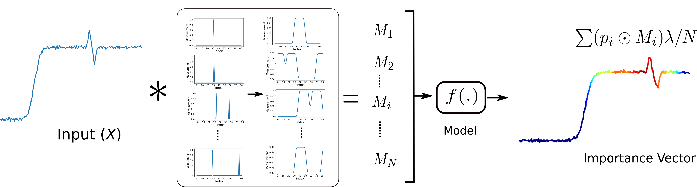
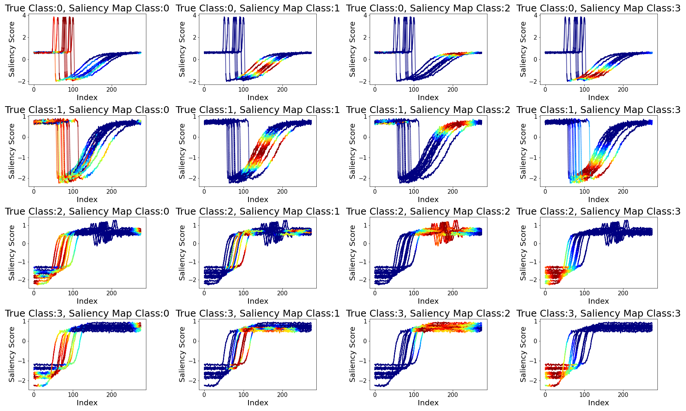

# TiME 
<!-- (Time-series-based Model outcome Explanation) -->
This repository contains cource code and supporting documents necessary to reproduce the results:

## Method Overview

Unlike images and text, a univariate ordered sequences of numbers are not as intuitive to humans for making sense of the model outcome. TiME is a time-series based model outcome explanation technique. Give a univariate input instance, the method assigns scores to input time units based on their sensitivity toward the output class. The method is based on a related work (https://arxiv.org/abs/1806.07421) that attributes scores as an expectation over the weighted random input subsamples where the weights are the model's confidence in the target class. However, unlike (https://arxiv.org/abs/1806.07421), to retain the temporal structural in the the sub-samples, TiME perform MCMC sampling of the input sequence such that they are contiguous segments of the inputs. This is followed by adding gaussian noise, which helps avoid the introduction of spurious evidence in the sub-samples. 

## Evaluation
The method is evaluated against a wide range of time-series datasets from UCI repository. Another set of evaluation is done on PhysioNet MIT-BIH ECG dataset. 

<!-- The evaluation is also done across a wide range of classification models such as ResNet, Inception Net, FCN, MLP, CNN. -->

## Related scripts and notebooks comig soon ...

## Repository contents will include
* TiME complete implementation is available in the form of notebook in [scripts/TiME-PhysioNet.ipynb](), prototyped using keras framework.
* TiME implementation is also available for demonstration ias python scripts under scripts folder.  
* Notebook  shows the working of TiME using the PyTorch framework and evaluated using PhysioNet ECG dataset.

## Examples

